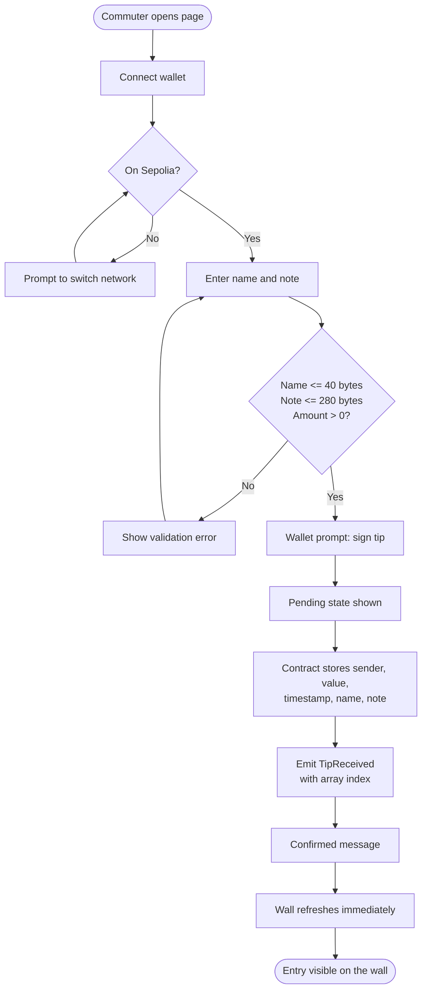
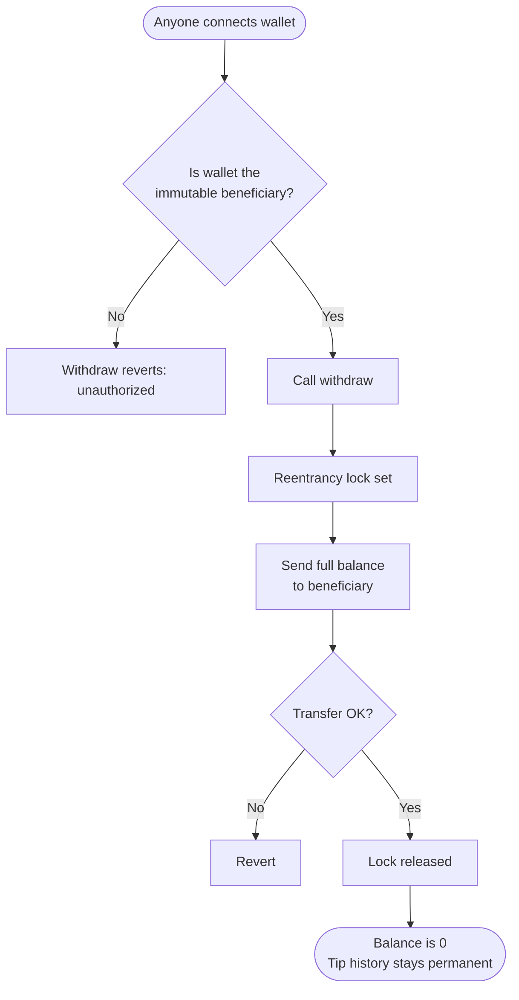
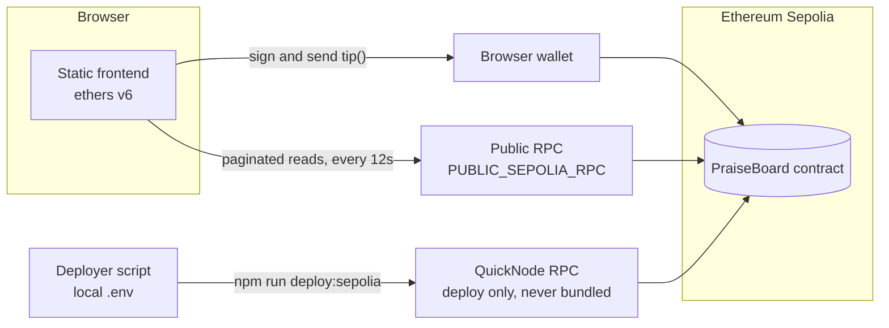
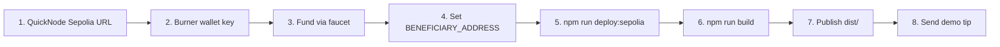

# The Praise Board

A permissionless thank-you wall for Ifeoma's community bus timetable. Commuters send a small tip and a public note; the note lives on-chain forever.

**Stack:** Solidity + Hardhat + ethers v6, with a lightweight, responsive static frontend.
**Principles:** no platform fee, no server database, no custodial wallet, no owner-controlled supporter list.

---

## Status

| Item | State |
|---|---|
| Contract (Sepolia) | ✅ Deployed at `0x8153EdA8EeB97D7709eD54FfAE2F6280ab7bc9f2` |
| Deployment tx | [View on Etherscan](https://sepolia.etherscan.io/tx/0x45e7df94740d4851707a233ece9efa578509a3deb55e1bae7583fce555c220c2) |
| Code and beneficiary | ✅ Verified through the public Sepolia RPC |
| Local tests | ✅ Solidity 0.8.28 compiles; all 5 contract tests pass |
| Frontend | ✅ JS syntax and HTTP serving pass |


> Local tests do not replace the real Sepolia demo. Complete it before claiming acceptance.

---

## How it works

### Tip flow



### Withdrawal flow



### Architecture



---

## Quick start

Requires Node.js 22+ and an Ethereum browser wallet.

```sh
npm ci
npm test
npm run build
npm start
```

Open http://127.0.0.1:4173. For a fresh clone, copy `.env.example` to `.env`. The `.env` file is Git-ignored, so never commit it.

---

## Deploy



1. **Endpoint.** Create an Ethereum Sepolia endpoint in QuickNode and put its HTTPS URL in `QUICKNODE_SEPOLIA_URL` in `.env`.
2. **Burner wallet.** Create a fresh wallet and put its key in `DEPLOYER_PRIVATE_KEY`. Never share it, commit it, or use a wallet holding real assets.
3. **Fund it.** Request Sepolia ETH from https://faucet.quicknode.com/ethereum/sepolia (eligibility is controlled by the faucet).
4. **Beneficiary.** Set `BENEFICIARY_ADDRESS` to Ifeoma's wallet. **Check it carefully: it is immutable, and only this address can withdraw.**
5. **Deploy.** Run `npm run deploy:sepolia`. The script checks the chain, deploys via QuickNode, waits two confirmations, saves `deployments/sepolia.json`, configures the page, and records the deployed address.
6. **Build.** Run `npm run build`. The private QuickNode URL is never bundled; the browser uses `PUBLIC_SEPOLIA_RPC`, which must be public or explicitly browser-safe.
7. **Publish.** Host `dist/` on static hosting (see Vercel below).
8. **Demo tip.** Connect a funded commuter wallet, switch to Sepolia, and send `0.001` ETH with a note. Save the confirmed transaction URL as evidence.

### Host on Vercel

Push the project files to GitHub, then import the repo into Vercel. The included `vercel.json` sets:

| Setting | Value |
|---|---|
| Framework | Other |
| Install command | `npm ci` |
| Build command | `npm run build` |
| Output directory | `dist` |

No private key or environment variables are needed to host the frontend. The deployed contract address is already in `dist/config.json`. **Never upload a filled `.env`.**

---

## 90-second hackathon demo

1. **Problem.** 9,000 commuters rely on a volunteer's timetable, and existing tip services add fees and access restrictions.
2. **Connect.** Open the page, connect a wallet, and show wrong-network recovery.
3. **Tip.** Send a small Sepolia tip with a note. Show the wallet prompt, pending state, confirmed message, and the new wall entry.
4. **Verify.** Open the contract link, inspect the `TipReceived` event in the receipt, and read the same tip with `getTip`.
5. **Withdraw.** Connect the beneficiary wallet and withdraw. Show that the tip history remains.

---

## Trust and architecture

- **Atomic writes.** `tip(name, note)` stores sender, value, timestamp, name and note, updates lifetime tips, and emits `TipReceived` with the array index, all in one transaction.
- **Storage is the source of truth.** The frontend reads paginated contract storage at a single block height per refresh. Events are independently inspectable receipts.
- **No fake data.** No off-chain database, local storage, or fabricated cards populate the wall.
- **Loading.** The newest 20 entries load first; older ones are paginated. Reads refresh every 12 seconds and right after a confirmed receipt.
- **Failure is visible.** A network failure is clearly marked, and stale records are never shown as fresh.
- **Confirmations.** The UI shows one confirmation, not finality. Reorgs can change recent entries, and the next refresh reconciles them.
- **RPC dependency.** Public RPCs are infrastructure dependencies. Readers can pick another endpoint or inspect the contract directly.

### Content rules

- Names are self-asserted, not verified. The wallet address is the canonical identity.
- User text is rendered with `textContent`, so no HTML injection.
- Notes are permanent and public. There is no delete, edit, or moderation.
- Limits: names ≤ 40 UTF-8 bytes, notes ≤ 280, enforced on both contract and frontend.
- Sepolia ETH has no monetary value, and the UI shows no dollar pricing.

### Treasury and contract limits

- Tips accumulate in the contract. Only the immutable beneficiary can withdraw the full available balance, always to that same address.
- There is no fee recipient, upgrade admin, pause, arbitrary payout address, or ownership transfer.
- Withdrawal uses a reentrancy lock and a checked external call. Failure reverts.
- **A lost beneficiary key permanently blocks withdrawals.**
- Plain ETH transfers revert. Forced ETH (for example via selfdestruct) can raise the balance without creating a supporter record, so lifetime tips and withdrawable balance are intentionally separate.
- The beneficiary may be a smart-contract wallet that can receive ETH.
- Each tip stores data on-chain, trading gas cost for simple permanent retrieval.
- No mainnet deployment is configured. This is a tested hackathon implementation, **not an audited production contract**.

---

## Validation

`npm test` covers:

- persisted records and emitted events
- zero-value tips
- name and multibyte note boundaries
- authorization
- withdrawal while history is preserved
- pagination
- invalid deployment and direct-transfer paths

Verification notes: a workspace-scoped Hardhat settings adapter was used for the sandbox's filesystem restrictions. Wallet UI and a real Sepolia tip are still unverified, and optional WebMCP browser validation was unavailable.

---


- [ethers v6](https://docs.ethers.org/v6/single-page/)
- [Hardhat](https://v2.hardhat.org/hardhat-runner/docs/getting-started)
- [Ethereum deployment](https://ethereum.org/developers/docs/smart-contracts/deploying/)

MIT licensed. See `LICENSE`.
